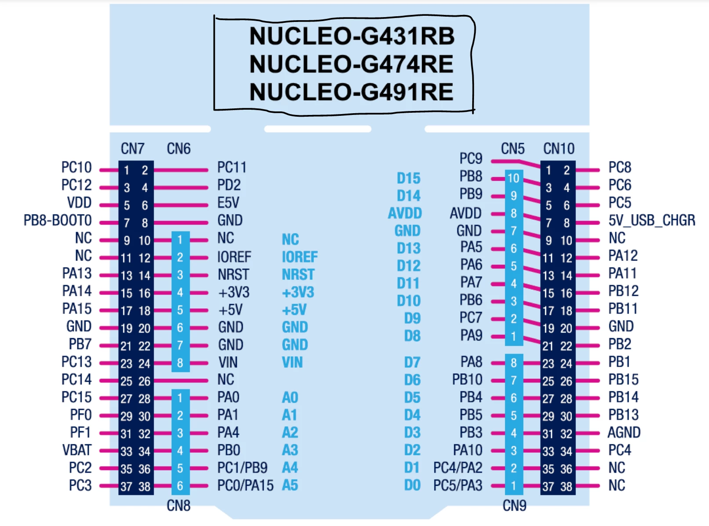
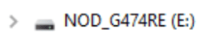

# FRA271_LAB1_SENSOR_FRAB12
## 1. ADC และ Encoder Pin Mapping

บอร์ดที่ใช้: **STM32G474RETx** (NUCLEO-G474RE)

### ADC (Single-Ended, อ่านต่อเนื่องผ่าน DMA)

| Channel (Simulink) | Pin | ADC Channel |
|---|---|---|
| A0 | PA0 | ADC1_IN1 |
| A1 | PA1 | ADC2_IN2 |
| A2 | PA4 | ADC2_IN17 |
| A3 | PB0 | ADC1_IN15 |
| A4 | PC1 | ADC1_IN7 |

- ADC1 อ่าน 3 ช่อง (A0, A3, A4) เรียงตาม Rank: IN1 → IN7 → IN15
- ADC2 อ่าน 2 ช่อง (A1, A2) เรียงตาม Rank: IN2 → IN17
- ทั้งสอง ADC ตั้งเป็น Continuous Conversion + DMA Circular

### Encoder (TIM Encoder Mode, x1/x2/x4)

| Channel (Simulink) | Timer | Pin CH1 | Pin CH2 | Encoder Mode |
|---|---|---|---|---|
| EncoderX1 | TIM1 | PC0 (TIM1_CH1) | PA9 (TIM1_CH2) | TI1 (x1) |
| EncoderX2 | TIM3 | PA6 (TIM3_CH1) | PA7 (TIM3_CH2) | TI2 (x2) |
| EncoderX4 | TIM4 | PA11 (TIM4_CH1) | PA12 (TIM4_CH2) | TI1&TI2 (x4) |

## 2. อัปโหลด .bin เข้า STM32

1. เสียบบอร์ด STM32 เข้าคอมพิวเตอร์ผ่านสาย USB จะมี Drive (Mass Storage) ขึ้นมาเหมือน Flash Drive

   

2. ลากไฟล์ `sensoerExpoler.bin` ไปวางลงใน Drive นั้นได้เลย
3. บอร์ดจะกระพริบไฟแล้วรีเซ็ตตัวเองเพื่อรันโปรแกรมใหม่โดยอัตโนมัติ

> ถ้าลองแล้วมีปัญหา ติดต่อพี่ TA ได้ที่ IG: **sxrx1st**

## 3. การติดตั้ง Waijung (ขั้นตอนคร่าวๆ)

1. แตกไฟล์ `waijung_18.11a.7z` ออกมาเป็นโฟลเดอร์ `waijung_18.11a`
2. เปิด MATLAB แล้ว `cd` เข้าไปที่โฟลเดอร์ที่แตกไว้
3. รันสคริปต์ติดตั้ง `install_waijung.m` (ดับเบิลคลิกหรือพิมพ์ `install_waijung` ใน Command Window)
4. รอจน MATLAB ติดตั้ง Waijung block library เสร็จ แล้ว restart MATLAB
5. ตรวจสอบว่ามี Waijung library ขึ้นใน Simulink Library Browser

## 4. การตั้งค่า Simulink เบื้องต้น

เปิดไฟล์ `sensorExpoler.slx` แล้วตั้งค่าดังนี้:

1. **Host Serial Setup** (aMG USB Converter N block)
   - ตั้ง **COM Port** ให้ตรงกับพอร์ตที่ ST-Link Virtual COM Port ปรากฏ (เช่น `COM4` — ดูได้จาก Device Manager)
   - Baud rate: `2000000`, Data bits: `8`, Parity: `None`, Stop bit: `1`

2. **Fixed-step Solver** (Simulation → Model Configuration Parameters → Solver)
   - Type: **Fixed-step**
   - Solver: `discrete (no continuous states)`
   - Fixed-step size: ให้สอดคล้องกับ sample time ของบล็อก Host Serial Rx (ตั้งไว้ที่ `0.001` วินาที)

3. กด **Run** เพื่อเริ่มรับข้อมูล real-time จากบอร์ด

## 5. Data Flow (Pin → Output)

แต่ละ Pin ที่อ่านค่าจาก STM32 จะถูกส่งออกไปที่ output port ชื่อเดียวกันในฝั่ง Simulink (block **Host Serial Rx**):

| Pin (STM32) | Output ใน Simulink |
|---|---|
| PA0 | A0 |
| PA1 | A1 |
| PA4 | A2 |
| PB0 | A3 |
| PC1 | A4 |
| PC0/PA9 (TIM1) | EncoderX1 |
| PA6/PA7 (TIM3) | EncoderX2 |
| PA11/PA12 (TIM4) | EncoderX4 |

แต่ละ output port ต่อไปเข้า Scope/Display ใน `sensorExpoler.slx` เพื่อดูค่าจาก Pin นั้นๆ แบบ real-time

---

หากมีปัญหาในการทำ Lab ติดต่อพี่ TA 
